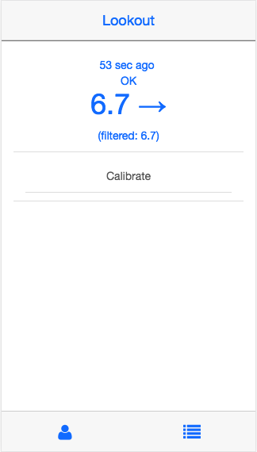

# Lookout

[](https://gitter.im/thebookins/xdrip-js?utm_source=badge&utm_medium=badge&utm_campaign=pr-badge&utm_content=badge)

*Please note this project is neither created nor backed by Dexcom, Inc.*
*Lookout is not a product. Lookout comes with no warranty or official support. Anyone using Lookout is doing so at their own risk and must take responsibility for their own safety. The use of Lookout for therapy is not FDA approved and comes with inherent risks.*

## Overview
Lookout provides a rig-based interface to a Dexcom G5 CGM using Bluetooth Low Energy (BLE).  Lookout connects to the CGM transmitter and provides the following capabilities:
- start and stop sensor sessions
- view reported glucose values
- send glucose values to OpenAPS and Nightscout
- send glucose values to Pump via fakemeter
- send finger stick calibration values to the transmitter
- reset expired transmitters
- calculate and report trend and noise values
- calculate and report CGM calibration slope and offset values
- report BG Check records to Nightscout obtained from transmitter's CGM calibration events
- report sensor state changes to Nightscout as announcements
- extend sensor operation beyond sensor expiration (limitations described below)
- report raw unfiltered values to Nightscout during warmup for trend visibility
- report detail transmitter and device status to Nightscout (requires Nightscout xdrip-js plugin to be enabled)

You can use Lookout with unexpired G5 and G6 transmitters relying on the official calibration built into the transmitter to calibrate the raw sensor values.  
Lookout enables you to reset expired transmitters, allowing you to use them past their normal expiration dates.  
You can use Lookout  also  with expired transmitters - in this case, Lookout uses a least squares regression calibration method to calculate calibration values for raw sensor values based on user entered glucose checks.

There are three ways to monitor and control Lookout:
1) Web-based graphical interface,
2) the `lookout` command line interface, 
3) Nightscout.

Typically, Lookout can run in parallel with a Dexcom receiver.  There are reported cases where Lookout did not interact well with a Dexcom receiver so YMMV.  
Lookout can also run in parallel with a Dexcom or xDrip app on a phone if started with the `alternate` flag. (`-c`)

A failure mode on the rig can prevent Lookout from completing the interaction with the transmitter to successfully read glucose values.  Lookout will automatically reboot the rig if it connects to the transmitter, but is unable to successfully retrieve a glucose value 2 times in a row.

The CGM transmitter enters sleep mode between each glucose read event to conserve power. Lookout only communicates with the transmitter during the brief moments it is awake during the glucose read event.  Commands entered by the user are are queued in the "Pending" queue to be sent to the transmitter when it is ready to receive messages at the next event. The Pending queue can be viewed using a browser or the `lookout` command. If the user enters an unintended command, the Pending queue can be flushed by restarting the rig before it sends the commands to the CGM transmitter.

### Official Calibration Mode
Official calibration mode is the default Lookout operating mode.  Lookout will only report calibrated glucose values received from the CGM transmitter. When running in official calibration mode, Lookout does not report glucose values from raw glucose values when the CGM Transmitter does not report a calibrated value due to events such as excessive noise, a stopped sensor session, or an expired transmitter.

### Extended Calibration Mode
Extended calibration mode is enabled with the `--extend_sensor` (`-e`) command line option.  In this mode, Lookout will report calibrated glucose values received from the CGM transmitter.  Lookout will also calculate the calibration offset and slope values using the calibrated and unfiltered raw value pairs. When the CGM Transmitter does not report a calibrated value due to events such as excessive noise, a stopped sensor session, or an expired transmitteri, Lookout will calibrate the unfiltered raw value with the calibration values it calculated when the CGM Transmitter was reporting calibrated values. 
To stop Lookout from continuing to report glucose values at the end of a sensor session, the user must do one of the items listed below:
* Execute `lookout stop` on command line
* Enter Sensor Stop in Browser Menu
* Enter a Sensor Stop in Nightscout
* Enter a Sensor Start in Nightscout --non-preferred method--
* Enter a Sensor Insert in Nightscout --non-preferred method--
Use case for Extended Calibration Mode: This enables Lookout to continue reporting glucose values after the sensor session is ended, providing greater flexibility on when the user changes the site.  This is not intended to extend a sensor life past 24 hours due to the lack of an ongoing calibration update mechanism.

### Expired Calibration Mode
Expired calibration mode is enabled with the `--expired_cal` command line option.  In this mode, Lookout will use a built-in algorithm to calibrate the unfiltered raw glucose values based on calibration offset and slope calculated from user entered BG Checks provided in either Nightscout or the Lookout calibration entry methods. When the CGM Transmitter does not report a calibrated value due to events such as excessive noise, a stopped sensor session, or an expired transmitteri, Lookout will calibrate the unfiltered raw value and report the calibrated glucose result. To stop Lookout from continuing to report glucose values at the end of a sensor session, the user must do one of the items listed below:
* Execute `lookout stop` on command line
* Enter Sensor Stop in Browser Menu
* Enter a Sensor Stop in Nightscout
* Enter a Sensor Start in Nightscout --non-preferred method--
* Enter a Sensor Insert in Nightscout --non-preferred method--

**WARNING** Expired calibration mode uses a custom algorthm that is unable to guarantee the various sensor failure modes are appropriately handled. Therefore, it is NOT recommended. 

## Pre-installation
### Intel Explorer Rig
You must update your rig's NodeJS based on https://github.com/xdrip-js/xdrip-js/wiki (only use the "Updating NodeJS" section of those instructions, you should not install xdrip-js manually, it will be installed in the next step as part of Lookout.)
As of 13-Jun-2018, these steps are:
```
The version of Node that ships with jubilinux is old (v0.10.something). Lookout requires version 8 or later. Here are the instructions for updating Node:

apt-get remove nodered -y
apt-get remove nodejs nodejs-legacy -y
apt-get remove npm  -y # if you installed npm
curl -sL https://deb.nodesource.com/setup_8.x | sudo bash -
apt-get install nodejs -y
```
If you later need to revert your rig's NodeJS to the legacy version, follow the steps in the below section "Reverting NodeJS".

### Raspberry Pi Rig
The version of NPM that ships with raspbian is old (`1.4.21`).  You must update your rig's NPM to install Lookout dependencies.
```
npm install -g npm
```

**INFO** To start using the new version, you must log out and log back in for the shell to see it.

Lookout uses the bluez-tools and libudev-dev software. Here are the instructions for installing them:

```
sudo apt-get install bluez-tools
sudo apt-get install libudev-dev
```

Lookout requires the openaps cgm type to be ```xdrip```. If you are not running xdrip as the openaps cgm type, then offline looping will not work. To change cgm type, re-run oref0-setup and choose xdrip as the cgm type.

## Installation
```
cd ~
git clone https://github.com/xdrip-js/Lookout.git
cd Lookout
npm install
npm link
```
## Testing
```
npm test
```

## Updating Your Rig
### Update Rig to Latest version of **Lookout master branch**
Use this code to update to the current `master` branch:
```
cd ~/Lookout
git remote remove upstream # Just in case one already exists - this command may error, but that is OK
git remote add upstream https://github.com/xdrip-js/Lookout.git
git fetch upstream
git checkout --force upstream/master # Force a checkout of the current master even if we have made local changes
git checkout -B master # Force an overwrite of the local master with the upstream master
npm install
npm link
```
If your upstream is already set to the xdrip-js repository, you can skip the `git remote` commands.  The current git remote repositories can be displayed with the `git remote -v` command.

After updating the rig, reboot to restart Lookout with the updated version.

### Update Rig to Latest version of **Lookout dev branch**
Running the `dev` branch? Use this code instead to update to the current `dev` branch:
```
cd ~/Lookout
git remote remove upstream # Just in case one already exists - this command may error, but that is OK
git remote add upstream https://github.com/xdrip-js/Lookout.git
git fetch upstream
git checkout --force upstream/dev # Force a checkout of the current dev even if we have made local changes
git checkout -B dev # Force an overwrite of the local dev with the upstream dev
npm install
npm link
```
If your upstream is already set to the xdrip-js repository, you can skip the `git remote` commands.  The current git remote repositories can be displayed with the `git remote -v` command.

After updating the rig, reboot to restart Lookout with the updated version.

## Example usage
Just type `Lookout`. The app will run on port 3000.

To see verbose output (>> Lookout's log messages have more detail - can help with trouble-shooting, and help you understand what Lookout is doing when it runs), use `Lookout -v`. To see even more verbose output, use `Lookout -vv`. Alternatively, use `sudo DEBUG=* Lookout`, and replace the `*` with a comma separated list of the modules you would like to debug. E.g. `sudo DEBUG=transmitterIO:*,smp,transmitter,bluetooth-manager Lookout`. 

To run in simulated mode, use `node index.js --sim`.

To view the app, open a browser and navigate to `http://<local IP address>:3000`. E.g. http://localhost:3000 or http://192.168.1.3:3000. This will vary depending on your local network setup.



## Using the browser to control your CGM
Once the browser is open to your Lookout page (see above steps), you can:
* pair a transmitter
* set the fakemeter id
* reset the paired transmitter
* view transmitter status
* start a sensor session
* stop a sensor session
* calibrate

**Note** You can continue using the Dexcom receiver alongside Lookout to do these things as well. Both the receiver and Lookout will get the latest updates from the CGM transmitter after a reading or two, provided they are in range and connected.

### Using the browser to pair Lookout to a transmitter
1. Click "Menu" button (bottom right button) on the Lookout page
2. Click `CGM` and then `Transmitter`
3. Click `Pair New`
4. Enter your transmitter ID (note it is case-sensitive)
5. Click `Save`

### Using the browser to start a CGM sensor session
1. Put the sensor/transmitter on your body, if you haven't already
2. Click the "Home" button (looks like a person) at the bottom left of the Lookout page
3. Click `Start sensor` (starting a sensor can be done either from the receiver or Lookout and it will show started on both)
4. Click the "Menu" button, then `CGM` and `Sensor`
** New:** If you are using Dexcom G6, you can now enter the sensor code when you use the browser to start the sensor. 
5. Within 5 minutes the `State` should show as `Warmup`
6. Click the "Home" screen (bottom left, person button), you will also see Warmup on the Home screen
**G5 only:** 
  7. After 2 hours the state will change to `First calibration`
  8. Click the `Calibrate` button to enter the first calibration
  9. Enter the value from a finger stick and click `Save` 
  10. Click the "Home" screen
  11. Click the `Calibrate` button to enter the second (you can wait for the state to change in 5 minutes, or enter it right after the first calibration)
  12. Enter the value from a second finger stick and click `Save`
  13. After 5 minutes the state will change to `OK` and calibrated BG values will be displayed. 
**G6:** Lookout normally moves from warmup to reporting BG levels - no calibration needed. It takes 10 - 15 minutes time to get there.

**NOTE** There is a second button on the "Home" screen, `Start sensor 2 hours ago`, that can be used to send a start message backdated by 2 hours from the current time.  This allows the user to pre-soak a sensor while the ongoing session continues.  When the ongoing session ends, move the transmitter to the new sensor and use the `Start sensor 2 hours ago` button to start the new session.  This will normally provide the user with a First calibration request within 5 to 10 minutes instead of 2 hours. (**For G6:** Lookout will move into logging the BGs, without need for calibration)

**NOTE**: As always, closely monitor the sensor behavior and BGs. If you are using back-start with a sensor that has already been in use for a few days, there is a higher chance that the sensor readings are off than with a new sensor - act accordingly. Never forget that your APS system uses these BG values to make insulin dosing decisions. It is essential that the BGs are valid. When in doubt, take action, and don't loop with bad BGs readings! It can be educational to run two sensors/transmitters in parallel sometimes, to learn more about behaviors.

### Using the browser to calibrate 
1. Click the "Home" button (looks like a person) at the bottom left of the Lookout page
2. Click the `Calibrate` button to enter a finger stick calibration value
3. Enter the value from a finger stick and click `Save`
**NOTE** Calibrating a sensor is a significant event that affects future BG readings. Know what you are doing, and calibrate following manufacturer's instructions. (examples: Use valid BGs, calibrate only when BGs are flat, don't calibrate too often, ...)

### Using the browser to stop a CGM sensor session
1. Click the "Menu" button, then `CGM` and `Sensor`
2. Click the `Stop Sensor` button
3. Click the `Stop` button to confirm
4. After 5 minutes, the sensor state will change to `Stopped`

### Using the browser to view the Pending command list
1. Click the "Menu" button, then `CGM` and `Sensor`
2. Click the `Pending` button

### Using the browser to reset the transmitter
1. Ensure the transmitter is paired as described above
2. Ensure the transmitter is not currently in a sensor session. Stop session if necessary.
3. Click the "Menu" button, then `CGM` and `Transmitter`
4. Click the `Reset Transmitter` button
5. Click the `Reset` button to confirm
6. Wait 5 minutes and press the "Menu" button, then `CGM` and `Transmitter`
7. Verify the `Age` is now less than a day.

### Using the browser to set the fakemeter meter id
1. Click the "Menu" button, then `CGM` and `Transmitter`
2. Click the `Set Fake Meter ID` button
3. Enter the ID, and click the `Save` button
4. Set a meter ID on the pump to match

## Using the command line to control your CGM
The commands below can be entered on the rig command line to control the CGM. Regardless of which command is entered, after executing the command the command will enter a status loop indefinately printing the CGM status at each glucose read event. Enter `Ctrl-C` to exit the command. Arguments identified with angle brackets (`<>`) are required. The command will issue an error if the argument is not provided. Arguments identified with square brackets (`[]`) are optional depending on the specific context. For example, the start command requries a sensor serial number argument to use the no-calibration feature with a G6 transmitter, but does not require the code if you are using a G5, or if you are using G6 without the sensor code. Example, if you threw away the G6 sensor code and did not take a photo, you can still use the sensor, but you will need to calibrate when prompted. To avoid this, always take a photo of both the sensor code and the transmitter code, when you insert your new sensor). 
```
  lookout cal <sgv>                  # Calibrate the transmitter with glucose meter reading. Example: `lookout cal 100`
  lookout id <id>                    # Set transmitter ID. Example: `lookout id 9515`
  lookout meterid <meterid>          # Set fakemeter ID. Example: `lookout meterid 123456`
  lookout start [sensor_serial]      # Start sensor session; sensor serial required for G6. Example: `lookout start 9515`
  lookout back-start [sensor_serial] # Start sensor session back dated by 2 hours; sensor serial required for G6. Example: `lookout back-start 9515`
  lookout stop                       # Stop sensor session
  lookout reset                      # Reset transmitter
  lookout status                     # Show status  [default]
```

Use `-m` option for mmol instead of mg/dL. For example, `lookout -m cal 4.1` will calibrate with 4.1 mmol.

### More Command Line Examples
```
 lookout cal 121             # Calibration with glucose meter reading of `121`
 lookout id G123T1           # Set transmitter ID to `G123T1`
 lookout meterid 062470      # Set fakemeter ID to `062460` - Must mach meter ID setting on pump
 lookout start 9117          # Start a G6 sensor session for sensor serial number 9117
 lookout back-start 9117     # Start a G6 sensor session 2 hours prior to the current time for sensor serial number 9117
```

## Replacing a Sensor, using the command line
This assumes that a sensor session is active, and that you are using the same transmitter for both sessions. The goal is to minimize looping-downtime during the sensor change. This method works with G5 or G6 sensors.

### Pre-soak the sensor
1. Insert new sensor some time before old sensor is ready to come out (2+ hours).
If using a G6, note the sensor serial number. You will want need it later to start, to restart the sensor, and for troubleshooting. (take a photo ...)

### Stop current sensor session once you are ready to change sensors
2. To stop the current sensor session, enter `lookout stop`.
Note: Time the sensor change for a time where "not looping" for a while is OK - this might take some time to complete. Plan for 30 min, or more if something goes wrong.

### Swap transmitter to new sensor
3. Transfer the current transmitter from the old sensor to the new, pre-soaked sensor.
Note: Don't reset the transmitter now, or you will have to wait the 2 hours designed into the Dexcom system for a sensor change. Same, if you are starting with a new transmitter.

### Start new sensor - "2 hours ago"
4. Enter `lookout back-start sensor_serial`

### Wait a few minutes (~10 - 20 min)
5. After a few minutes, the sensor should be reporting BG values. You might be asked to calibrate, or not. Keep that glucose meter handy, just in case.
Yay. Go on looping with a new sensor!

** Note:** `lookout back-start` will probably not work if you reset/have reset the transmitter after the "back-start" time, or start with a new transmitter. The transmitter must be "known to the rig" for 2 hours or more, to successfully back-start a sensor.


## Using Nightscout to control your CGM
Entering records in Nightscout can also be used to control your CGM. Lookout synchronizes with Nightscout 30 seconds prior to every transmitter read event. Therefore, the entries described below must be inserted into Nightscout at least 30 seconds prior to the next read event or it will not be executed until the following event.

### CGM Sensor Start
Enter a CGM Sensor Start into Nightscout to start a sensor session if one is not running. A sensor start will also cause Lookout to delete the extended and expired calibration values if they exist which will effectively end any extended or expired sensor sessions. If the transmitter does not have an active sensor session, Lookout will cease reporting calibrated glucose values.  Sensor start on a G6 does not yet support adding the sensor serial number when you use Nightscout, so the session will require calibration and not benefit from the G6's feature for 10 days without calibrations. (use command line or browser instead for "10 days no cal" on a G6 sensor)

### CGM Sensor Insert
Entering a CGM Sensor Insert will also cause Lookout to delete the extend and expired calibration values if they exist which will effectively end any extended or expired sensor sessions. If the transmitter does not have an active sensor session, Lookout will cease reporting calibrated glucose values.

### CGM Sensor Stop
Enter a sensor stop into Nightscout to stop a sensor session. 

### BG Check
Enter a BG Check into Nightscout to calibrate the transmitter and the expired calibration algorithm.

## Nightscout CGM Status Pill
This feature requires Nightscout 0.10.3 or later. Lookout provides devicestatus records to Nightscout which will display the CGM status in a CGM pill if the Nightscout xdrip-js plugin is enabled. See the Nightscout README for details on enabling the plugin and settings.

## Making it permanent
So far in the above you've only run Lookout from the command line - the next time you close your terminal, or reboot your rig, Lookout will only run if you add this to your crontab:
```
<type the command `crontab -e` and add this line:>
@reboot Lookout >> /var/log/openaps/lookout.log 2>&1
<save and exit your editor>
<reboot your rig with the command `reboot`>
```

## Debugging
To look at the Lookout log, for debug purposes, type `cat /var/log/openaps/lookout.log` or `tail -n 100 -F /var/log/openaps/lookout.log`.
* If your lookout.log file contains messages similar to `Error: /root/Lookout/node_modules/bluetooth-hci-socket/build/Release/binding.node: undefined symbol: _ZN2v816FunctionTemplate3NewEPNS_7IsolateEPFvRKNS_20FunctionCallbackInfoINS_5ValueEEEENS_5LocalIS4_EENSA_INS_9SignatureEEEi` run the following command: `cd ~/Lookout; npm rebuild`

* If Lookout is not running after it worked fine previously, a corrupted storage file might be the reason. 
run `npm test` in the Lookout directory.
if `npm test` shows an error involving /root/Lookout/storage/4043d6c394234319fe0d3f18c04e3eb9, remove the implicated file, then reboot. If this does not fix the problem, and you cannot get Lookout to work, hop on Gitter to ask for help.
The command is `rm`. To do all this: 
`cd` to get to the root level, `cd Lookout` to get into the Lookout directory, then `npm test`. It takes a few minutes to finish the test: You see the result of the testing, and the command promp appears again. If `npm test` finds the problem described above, copy the path that is implicated as the problem, then enter the following in the command line: 
`rm` and paste the file path. The enter. If all goes well, you see another command prompt. You can enter the same command to see what happens; it should error out, telling you that there is no such file (since it was removed in the previous step, this is what you want to see)
enter   `reboot`. Get a coffee. 
A few minutes later, after rebooting the rig, Lookout should be working again, if you included Lookout in your crontab (see above #making it permanent# . 
Enter `Lookout` in the command line, and it should "report for work" by showing the transmitter code, sensor status, etc.
Happy Looping.


## Lookout Command Line Options
* `--extend_sensor`, `-e`: Enables using the calibrated and unfiltered values reported by the CGM to calculate the running calibration slope and intercept values whenever the current calibration values it has produces a calibrated value that is more than 5 mg/dL away from the CGM reported calibrated value.  Lookout will apply the most recent calculated calibration to the CGM's unfiltered value if the transmitter does not report a calibrated glucose.  This enables Lookout to continue reporting glucose values after the sensor session is ended, providing greater flexibility on when the user changes the site.  This is not intended to extend a sensor life past 24 hours due to the lack of an ongoing calibration update mechanism.

**WARNING** If running in extended sensor mode, the user must enter a `Sensor Insert` in Nightscout to notify Lookout to stop reporting glucose values.

* `--expired_cal`, `-x`: Enables using user entered BG Check and Sensor Start records to calibrate raw unfiltered values reported by the CGM transmitter. Lookout does not perform calibration for 15 minutes after a Sensor Start. During the first 12 hours after a Sensor Start, Lookout only uses a Single Point calibration algorithm that assumes a y axis intercept of 0.  After the first 12 hours, Lookout will switch to using a Least Squares Regression algorithm to calculate the y axis intercept and slope to convert the raw unfiltered values to calibrated glucose values.  Transmitter provided calibrated glucose readings take presedence over the Lookout calibration algorithm.  If the transmitter doesn't provide a calibrated value, Lookout will calibrate the unfiltered value.  Extend sensor mode takes presedence over expired calibration mode.

**WARNING** Expired calibration mode uses a custom algorthm that is unable to guarantee the various sensor failure modes are appropriately handled. Therefore, it is NOT recommended. 

* `--verbose`, `-v`: Enables verbose logging.

* `--alternate`, `-c`: Enables using the alternate Bluetooth channel to communicate with transmitter. This allows the rig to operate in parallel with the Dexcom phone app or xDrip+.

* `--sim`, `-s`: Runs Lookout in simulation mode for offline testing.

* `--fakemeter`, `-f`: Enables sending blood glucose readings to the pump configured in the OpenAPS directory as meter readings. Configure the pump to enable the meterid configured in Lookout. This option requires oref0 version 0.7.0 or later.

* `--offline_fakemeter`, `-o`: Enables sending blood glucose readings to the pump as described in `--fakemeter`, but only when the rig is offline.

* `--port`, `-p`: Sets the port number for the web server providing the Lookout GUI.

* `--hci`, `-h`: Sets the Bluetooth adapter to use to communicate with transmitter.

* `--openaps`, `-d`: Sets the OpenAPS directory. The default directory is `/root/myopenaps`

* `--no_nightscout`, `-n`: Disable Nightscout interaction.

* `--include_mode`, `-i`: Append algorithm mode to the short state string displayed in Nightscout pill.

* `--read_only`, `-r`: Read only mode for a backup reader. Also lazy uploads to Nightscout to prevent double uploading glucose values. Use case is for a second rig that provides BG read redudancy while primary rig is responsible for sending commands to transmitter.

## Reverting NodeJS

in the future if you decide you do not want to use xdrip-js, or you are having trouble updating OpenAPS with the nodejs update, you can revert the nodejs install with:
```
sudo apt-get remove nodered -y
sudo apt-get remove nodejs nodejs-legacy -y
sudo apt-get remove npm -y
sudo aptitude install nodejs-legacy
<say no to the first prompt about keeping nodejs-legacy at current version, say yes to the 2nd prompt about installing nodejs 'oldstable' version>
```

## Interaction with Dexcom Receiver
YDMV, so test it until you are comfortable. A few people have run Lookout concurrently with their Dexcom receiver (or Dexcom phone app with `--alternate` option) without perceiving negative impacts to either. Others have been less successfull.
